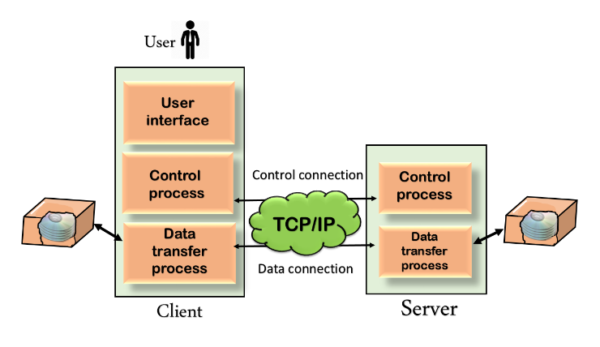

FTP 

FTP stands for File Transfer Protocol.FTP is a standard internet protocol provided by TCP/IP used for transmitting the files from one host to another.It is mainly used for transferring the web page files from their creator to the computer that acts as a server for other computers on the internet.It is also used for downloading the files to computer from other servers.

FTP Mechanism

FTP connection Type

Control Connection: 
        For sending control information like user identification, password, commands to change the remote directory, commands to retrieve and store files, etc., FTP makes use of a control connection. The control connection is initiated on port number 21. 

Data Connection: 
       For sending the actual file, FTP makes use of a data connection. A data connection is initiated on port number 20. 
FTP sends the control information out-of-band as it uses a separate control connection. Some protocols send their request and response header lines and the data in the same TCP connection. For this reason, they are said to send their control information in-band. HTTP and SMTP are such examples

FTP Commands
Some of the FTP commands are: 

USER – This command sends the user identification to the server.
PASS – This command sends the user password to the server. 
CWD – This command allows the user to work with a different directory or dataset for file storage or retrieval without altering his login or accounting information. 
RMD – This command causes the directory specified in the path name to be removed as a directory. 
MKD – This command causes the directory specified in the pathname to be created as a directory. 
PWD – This command causes the name of the current working directory to be returned in the reply. 
RETR – This command causes the remote host to initiate a data connection and send the requested file over the data connection. 
STOR – This command causes the storage of a file in the current directory of the remote host. 
LIST – Sends a request to display the list of all the files present in the directory. 
ABOR – This command tells the server to abort the previous FTP service command and any associated transfer of data. 
QUIT – This command terminates a USER and if file transfer is not in progress, the server closes the control connection.